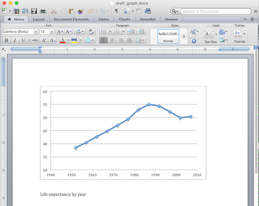

Open and Reproducible Science with R
=====
font-family: 'Helvetica'
width: 1024
height: 768

<p style="text-align: center;">
A two day workshop in 3 hours
</p>
<p style="text-align: center;">
Mine Çetinkaya-Rundel, Duke University <br/>
Colin Rundel, Duke University <br/>
François Michonneau, University of Florida <br/>
Tracy Teal, Data Carpentry
</p>
<p style="font-size: smaller; text-align: center">useR!2017 -- Brussels
<br/>
<!-- public domain dedication copied from CC -->
  <a rel="license"
     href="http://creativecommons.org/publicdomain/zero/1.0/">
    
  </a>
</p>


Reproducibility crisis
=====

* Only 6 of 56 landmark oncology papers confirmed
* 43 of 67 drug target validation studies failed to reproduce
* Effect size overestimation is common

***

[](http://www.nature.com/nature/focus/reproducibility/index.html)


Reproducibility matters
=====
incremental: true

Lack of reproducibility in science causes significant issues

* For science as an enterprise
* For other researchers in the community
* _For public policy_

Science retracts gay marriage paper
=====

* Science retracted (without lead author's consent) a study of how
  canvassers can sway people's opinions about gay marriage

* Original survey data was not made available for independent
  reproduction of results (additionally, survey incentives were misrepresented and
  sponsorship statements were incorrect)

* Two Berkeley grad students attempted to replicate the study and
  discovered serious issues with the data (were able to show data 
  almost certainly fabricated, and how they were generated).

Source:
http://news.sciencemag.org/policy/2015/05/science-retracts-gay-marriage-paper-without-lead-author-s-consent


Reproducibility matters
=====

Lack of reproducibility in science causes significant issues

* For science as an enterprise
* For other researchers in the community
* For public policy
* _For patients_


Seizure study retracted after authors realize data got "terribly mixed"
=====

From the authors of **Low Dose Lidocaine for Refractory Seizures in
Preterm Neonates** ([doi:10.1007/s12098-010-0331-7](http://dx.doi.org/10.1007/s12098-010-0331-7):

> The article has been retracted at the request of the authors. After carefully re-examining the data presented in the article, they identified that data of two different hospitals got terribly mixed. The published results cannot be reproduced in accordance with scientific and clinical correctness.

Source: [Retraction Watch](http://retractionwatch.com/2013/02/01/seizure-study-retracted-after-authors-realize-data-got-terribly-mixed/)


Reproducibility matters
=====

Lack of reproducibility in science causes significant issues

* For science as an enterprise
* For other researchers in the community
* For policy making
* For patients
* _For oneself as a researcher_


Reproducibility = Accelerating science, including your own
=====

<br><br>

* Research that is difficult to reproduce impedes your future self, and your lab.
* More reproducible research is faster to report, in particular when research is dynamic. (Think data, tools, parameters, etc.)
* More reproducible research is also faster to resume or to build on by others.

<p class="highlight" style="margin-top: 10px;">Reproducible science accelerates scientific progress.</p>

***

<br><br>

[](https://plus.google.com/+BrunoOliveira/posts/MGxauXypb1Y)
<small>Bruno Oliviera</small>


Computational research 
=====
incremental: true

Methods are codified by definition, yet still challenging to reproduce

* _Dependency hell_: Most software has large (often invisible) recursive dependencies.  Any one can fail to install, conflict with those of others, and the exact versions can affect results.
* _Documentation gaps_: Code can be very difficult to understand if not documented. Documentation gaps and errors may be harmless for experts, but are often fatal for "method novices".
* _Unpredictable evolution_: Scientific software evolves constantly and often in drastic rather than incremental ways. As a result, results, algorithms, and parameters can change in unpredictable ways, and can render code to fail after it worked only a short while ago.

See [an experiment on reproducing reproducible computational research](https://storify.com/hlapp/reproducibility-repeatability-bigthink).


Overcoming the training gap
=====

<br>


[](https://github.com/Reproducible-Science-Curriculum)

***

<br>

* Curriculum development hackathon held December 11-14, 2014, at NESCent
* 21 participants comprising statisticians, biologists,
  bioinformaticians, open-science activists, programmers, graduate
  students, postdocs, untenured and tenured faculty
* Outcome: open source, reusable curriculum for a two-day workshop on
  reproducibility for computational research


Current Syllabus
=====

**Day 1**
* Motivation of and introduction to Reproducible Research
* Best practices for file naming and file organization
* Best practices for tabular data
* Literate programming and executable documentation of data modification

***

**Day 2**
* Version control and Git
* Why automate?
* Transforming repetitive R script code into R functions
* Automated testing and integration testing
* Sharing, publishing, and archiving for data and code


Exercise: Motivating reproducibility
=====
type: titleonly


Exercise: Motivating reproducibility
=====
type: prompt

<br/><br/>
This is a two-part exercise:

**Part 1:** Analyze + document

**Part 2:** Swap + discuss


Part 1: Analyze + document
=====
type: prompt

Complete the following task using whatever workflow and tools you feel most comforable with. Your solution must include a brief write-up / documentation such that you could pass the file(s) to a collaborator and they would be able to reproduce your results.

1. Download the data: http://bit.ly/2sEPe4z ([Full Link](https://raw.githubusercontent.com/Reproducible-Science-Curriculum/cbb-retreat/master/material/data/gapminder-5060.csv))

2. Visualize life expectancy over time for Canadians in the 1950s and 1960s using
a line plot of these data.

3. Something should be clearly wrong with your plot, figure out (and document) what this is and come up with a fix.

4. With the revised data, visualize life expectancy over time for Canadians again.<br>
*Stretch goal:* Add additional lines for the life expectancy of  Mexician and Americans as well.


Part 2: Swap + discuss
=====
type: prompt

Introduce yourself to your collaborator(s) /neighbor(s).

1. Swap instructions / documentation with your collaborator and read through their results and write-up. As you read it over think about how you would attempt to reproduce their work.

2. If your collaborator/neighbor does not have or is unfamiliar with the software/technology you used we
encourage you to given them a brief explination of what it is and why you chose it. (Remember, this could be part of the irreproducibility problem!)

3. Finally, talk to each other about challenges you faced (or didn't face) or why
you were or weren't able to reproduce their work.


Reflection
=====
type: prompt

This exercise:
- What tools did you use (Excel, R / Python, Word / plain text etc.)?
- What made it easy / hard for reproducing your partners' work?

In a "real life" setting:
- What would happen if your colleague/collaborator is no longer available to walk you through their analysis?
- What would have to happen if you
    - had to swap out the dataset or extend the analysis?
    - caught further errors and had to re-create the analysis?
    - you had to revert back to the original dataset?


Four facets of reproducibility
=====
type: titleonly


Four facets of reproducibility
=====

1. **Documentation:** explanation and commenting of why and how an analysis is carried 
out in human readable language

2. **Organization:** tools to organize your projects so that you don't have a single
folder with hundreds of files

3. **Automation:** the power of scripting to create automated (and self documenting) data analyses

4. **Dissemination:** publishing is not the end of your analysis, rather it is a way
station towards your future research and the future research of others


Documentation
=====
type: titleonly


Accessible documentation
=====

Documentation takes many forms (e.g. the README of a github repo, Rd files in an R package) depending on your project, be it a Journal Article, a blog post or an R - tou should strive to make it as frictionless as possible for new and existings users to access any documentation you create (plain text is always a safe assumption, Microsoft Word is not).


Literate Programming
=====

Provenance of *copy and pasted* figure:


***

vs. Provenance of R Markdown figure:
[](https://github.com/Reproducible-Science-Curriculum/rr-organization1/raw/master/files/lit-prog/countryPick4.pdf)


Demo - Literate Programming with RMarkdown
=====
type: titleonly


Data sanity checks
=====

<br/>


Reported life expectancy shouldn't exceed the most extreme age observed for humans.


```r
if (any(gap_5060$lifeExp > 150)) {
  stop("improbably high life expectancies")
}
```

```
Error in eval(expr, envir, enclos): improbably high life expectancies
```


More formal data integrity checks
=====

<br/>

The library `testthat` allows us to make this a little more readable:

```r
library(testthat)
expect_false(any(gap_5060$lifeExp > 150),
            "improbably high life expectancies")
```


Organization
=====
type: titleonly


Research projects grow
=====

<br/><br/>
- There are going to be files. _Lots of files._
- They will change over time.
- They will have complex relationships to each other, that will also change over time.

File organization and naming are effective (and necessary) weapons against chaos.


Three key principles for (file) names
=====
incremental: true

* Machine readable
    - easy to search for files later
    - easy to narrow file lists based on names
    - easy to extract info from file names (regexp-friendly)
* Human readable
    - name contains information on content, or
    - name contains semantics (e.g., place in workflow)
* Plays well with default ordering
    - use numeric prefix to induce logic order
    - left pad numbers with zeros
    - use ISO 8601 standard (YYYY-mm-dd) for dates


Exercise
=====
type: prompt

<font size="5">
Lets assume that you are collecting data on the amount of mRNA for a particular gene (BRAF) that is being produced by different strains of transgenic *E. coli* created via transformations using several different plasmids.

Devise a naming scheme for the files that is **both** "machine" and "human" readable. File names should contain the following information:

* Assays are performed on different days
* These particular assays are for BRAF mRNA
* Different plamids were used to transform the *E. coli* (e.g. Plasmid CL56)
* Readings come from a [plate containing multiple wells](https://c1.staticflickr.com/7/6118/6252392655_c4285c5aa6_b.jpg), 
  * Rows (e.g. A, B, C) represent samples from different cultures (but the same strain) 
  * Columns (e.g. 1, 2, 3) represent samples from the same culture (replicates) 
  * We obtain one *csv* file per well.

</font>

Example:
=====

```sh
$ ls *Plsmd*
2013-06-26_BRAFASSAY_Plsmd-CL56-1MutFrac_A01.csv
2013-06-26_BRAFASSAY_Plsmd-CL56-1MutFrac_A02.csv
2013-06-26_BRAFASSAY_Plsmd-CL56-1MutFrac_A03.csv
2013-06-26_BRAFASSAY_Plsmd-CL56-1MutFrac_B01.csv
2013-06-26_BRAFASSAY_Plsmd-CL56-1MutFrac_B02.csv
...
2013-06-26_BRAFASSAY_Plsmd-CL56-1MutFrac_H03.csv
```


```r
> list.files(pattern = "MutFrac_A") %>% head
[1] 2013-06-26_BRAFASSAY_Plsmd-CL56-1MutFrac_A01.csv
[2] 2013-06-26_BRAFASSAY_Plsmd-CL56-1MutFrac_A02.csv
[3] 2013-06-26_BRAFASSAY_Plsmd-CL56-1MutFrac_A03.csv
```

Example:
=====


```r
meta <- stringr::str_split_fixed(flist, "[_\\.]", 5)
colnames(meta) <- c("date", "assay", "experiment",
                    "well", "ext")
meta[,1:4]
```

```
     date         assay       experiment            well 
[1,] "2013-06-26" "BRAFASSAY" "Plsmd-CL56-1MutFrac" "A01"
[2,] "2013-06-26" "BRAFASSAY" "Plsmd-CL56-1MutFrac" "A02"
[3,] "2013-06-26" "BRAFASSAY" "Plsmd-CL56-1MutFrac" "A03"
[4,] "2013-06-26" "BRAFASSAY" "Plsmd-CL56-1MutFrac" "B01"
[5,] "2013-06-26" "BRAFASSAY" "Plsmd-CL56-1MutFrac" "B02"
[6,] "2013-06-26" "BRAFASSAY" "Plsmd-CL56-1MutFrac" "B03"
```


Best practices for file organization
=====
class: centered-image

[](http://dx.doi.org/10.1371/journal.pcbi.1000424)

<small>Noble, William Stafford. 2009. “[A Quick Guide to Organizing Computational Biology Projects](http://dx.doi.org/10.1371/journal.pcbi.1000424).” PLoS Computational Biology 5 (7): e1000424.</small>


A data science project using R
=====
title: false

```
|
+-- data-raw/
|   |
|   +-- gapminder-5060.csv
|   +-- gapminder-7080.csv.csv
|   +-- ....
|
+-- data-output/
|
+-- fig/
|
+-- R/
|   |
|   +-- figures.R
|	  +-- data.R
|	  +-- utils.R
|	  +-- dependencies.R
|
+-- tests/
|
+-- manuscript.Rmd
+-- make.R
```

Some organizing principles for files
=====

- `data-raw`: the original data, you shouldn't edit or otherwise alter any of
the files in this folder.
- `data-output`: intermediate datasets that will be generated by theanalysis.
      - We write them to CSV files so we could share or archive them,for example if they take a long time (or expensive resources) to generate.
- `fig`: the folder where we can store the figures used in the manuscript.
- `R`: our R code (the functions)
    - Often easier to keep the prose separated from the code.
    - If you have a lot of code (and/or manuscript is long), it's easier to navigate.
- `tests`: the code to test that our functions are behaving properly and that all our data is included in the analysis.


Automation
=====
type: titleonly


Write functions to automate everything
=====


```r
make_ms <- function() {
    rmarkdown::render("manuscript.Rmd",
                      "html_document")
    invisible(file.exists("manuscript.html"))
}
clean_ms <- function() {
    res <- file.remove("manuscript.html")
    invisible(res)
}
make_all <- function() {
    make_data()
    make_figures()
    make_tests()
    make_ms()
}
clean_all <- function() {
    clean_data()
    clean_figures()
    clean_ms()
}
```

Tests made easier
=====

`testthat` includes a function called `test_dir` that will run tests
included in files in a given directory. We can use it to run all the tests in
our `tests/` folder.


```r
test_dir("tests/")
```

Let's turn it into a function, so we'll be able to add some additional
functionalities to it a little later. We are also going to save it at the root
of our working directory in the file called `make.R`:


```r
## add this to make.R
make_tests <- function() {
    test_dir("tests/")
}
```

Version Control
=====
type: titleonly

Version Control -- bad
=====

Run on file names


Version Control -- OK
=====

Use informatively named files

```
2013-10-14_manuscriptFish.doc
2013-10-30_manuscriptFish.doc
2013-11-05_manusctiptFish_intitialRyanEdits.doc
2013-11-10_manuscriptFish.doc
2013-11-11_manuscriptFish.doc
2013-11-15_manuscriptFish.doc
2013-11-30_manuscriptFish.doc
2013-12-01_manuscriptFish.doc
2013-12-02_manuscriptFish_PNASsubmitted.doc
2014-01-03_manuscriptFish_PLOSsubmitted.doc
2014-02-15_manuscriptFish_PLOSrevision.doc
2014-03-14_manuscriptFish_PLOSpublished.doc
```


Version Control -- OK
====

Or zip the entire directory of your project files everytime you make a change, and save with date


Version Control -- Best
====

Use a version control system (e.g. git)


Why use git and GitHub?
====

Why use Git?

* Safe to experiment with code
* Easy to set up
* Keep a full history of your project
* Integrate well with RStudio

***

Features of a hosting service like GitHub

* Your project is backed up
* No setup: just tell git where your repo lives
* GitHub has a large community: your colleagues are already there
* Good interface and tools to collaborate with others
* All your work lives at the same place


Demonstration of RStudio's git integration
====
type: titleonly


Dissemination - Sharing, publishing, archiving
=====
type: titleonly


Why share / archive data & code?
=====
incremental: true

* funding agency / journal requirement
* community expects it
* _increased visibility / citation_

increased visibility / citation
=====
left: 70%

[](https://dx.doi.org/10.7717/peerj.175)

***

Piwowar & Vision (2013) "[Data reuse and the open data citation advantage.](https://dx.doi.org/10.7717/peerj.175)" PeerJ, e175

<small>Figure 1: Citation density for papers with and without publicly available microarray data, by year of study publication.</small>

Why share / archive data & code?
=====

* funding agency / journal requirement
* community expects it
* increased visibility / citation
* _better research_

Better research
=====
left: 70%

[](http://dx.doi.org/10.1371/journal.pone.0026828)

***

<small>Wicherts et al (2011) "[Willingness to Share Research Data Is Related to the Strength of the Evidence and the Quality of Reporting of Statistical Results.](http://dx.doi.org/10.1371/journal.pone.0026828)" PLoS ONE 6(11): e26828</small>

<p style="font-size: 75%">Figure 1. Distribution of reporting errors per paper for papers from which data were shared and from which no data were shared.</p>


Where archive & publish?
=====

* Domain-specific data repository (GenBank, PDB)
* Source code hosting service ([GitHub](http://github.com), [Bitbucket](http://bitbucket.com))
* Generic repository ([Dryad](http://datadryad.com), [Figshare](http://figshare.com), [Zenodo](http://zenodo.org))
* Institutional repository
* Journal supplementary materials


Where archive & publish?
=====

* Domain-specific data repository (GenBank, PDB)
* Source code hosting service ([GitHub](http://github.com), [Bitbucket](http://bitbucket.com))
* Generic repository ([Dryad](http://datadryad.com), [Figshare](http://figshare.com), [Zenodo](http://zenodo.org))
* Institutional repository
* ~~Journal supplementary materials~~


University libraries try to help
=====
title: false

<!-- Replace with your university library's data management guide -->
<iframe width="100%" height="700px" src="http://library.duke.edu/data/guides/data-management"></iframe>


How to share, publish: file formats
=====

**Do's**
* non-proprietary file formats
* text file formats (.csv, .tsv, .txt)

***

**Don't's**
* proprietary file formats (.xls)
* data as PDFs or images
* data in Word documents


Put a license on creative works
=====
type: titleonly


Software licensing guide
=====
left: 70%

[](10.1371/journal.pcbi.1002598.g002)

***

> Morin, Andrew, Jennifer Urban, and Piotr Sliz. 2012. “[A Quick Guide to Software Licensing for the Scientist-Programmer.](http://dx.doi.org/10.1371/journal.pcbi.1002598)” PLoS Computational Biology 8 (7): e1002598.


Don't put a license on facts (a.k.a. data)
=====
type: titleonly


Licenses versus community norms
=====

<center>[](http://creativecommons.org/about/cc0)</center>

From the [Panton Principles](http://pantonprinciples.org/faq/#Q11_What_are_community_norms_and_why_are_they_important):
> [In] the scholarly research community the act of citation is a commonly held community norm when reusing another community member’s work. [...] A well functioning community supports its members in their application of norms, whereas licences can only be enforced through court action and thus invite people to ignore them when they are confident that this is unlikely.


Good - Better - Best
=====

<br/>
<br/>
[](http://dx.doi.org/10.1126/science.1213847)
Peng, R. D. “[Reproducible Research in Computational Science](http://dx.doi.org/10.1126/science.1213847)” Science 334, no. 6060 (2011): 1226–1227


Forming reproducible habits pays off
=====
incremental: true

* Reproducible practices can be applied after the fact, but it's much harder.
    - And now you're doing this for others, rather than for your own benefits.
    - And seriously, you won't ever publish the stuff you're working on?
* Adopting practices for reproducible science from the outset pays off in multiple ways.
    - It's easy and little work while the project is still small and contains few files.
    - Now all you're doing is reproducible. No painful considerations when it comes to sharing stuff.
    - Your future self will reap the benefits.

R packages to help you
=====

### Documentation

* **`roxygen`**: document your functions (easy to read, even if project not organized as package)
* **`bookdown`**: provides support for cross-referencing, citations, etc. Works well even if output is not a book

### Organization

* **`projectTemplate`** useful to automate project setup

***

### Automation

* **[`remake`](https://github.com/richfitz/remake)** (not on CRAN), excellent package to build robust reproducible analyses.

### Dissemination

* **[`rfigshare`](https://github.com/ropensci/rfigshare)**: upload your datasets directly to [Figshare](https://figshare.com)


Acknowledgements
=====

* Funding and support:
    * US National Science Foundation (NSF)
    * National Evolutionary Synthesis Center (NESCent)
    * Center for Genomic & Computational Biology (GCB), Duke University
    * Moore Foundation


Eating our dogfood: text formats, version control, sharing
=====
<p/>
This slideshow was generated as HTML from Markdown using RStudio.

The Markdown sources, and the HTML, are hosted on Github:
https://github.com/fmichonneau/2017-useR-reproducibility

***

<p/>

[](https://www.rstudio.com)

Further Resources
=====

* Entire [suppl. doc](http://www.sciencemag.org/content/suppl/2015/04/29/348.6234.567.DC1/Finnegan.SM.pdf) generated from Rmarkdown: Finnegan et al. 2015. “[Paleontological Baselines for Evaluating Extinction Risk in the Modern Oceans](http://dx.doi.org/10.1126/science.aaa6635).” Science 348 (6234): 567–70.

* [Data Analysis for the Life Sciences](http://simplystatistics.org/?p=4311) - a book completely written in R markdown

* FitzJohn et al. 2014. “[How Much of the World Is Woody?](http://dx.doi.org/10.1111/1365-2745.12260)” The Journal of Ecology. doi:10.1111/1365-2745.12260. [Start to end replicable analysis on Github](https://github.com/richfitz/wood).

* Boettiger et al. “[RNeXML: A Package for Reading and Writing Richly Annotated Phylogenetic, Character, and Trait Data in R](http://dx.doi.org/10.1111/2041-210X.12469).” Methods in Ecology and Evolution, September. [Code archive and DOI assignment at Zenodo](http://dx.doi.org/10.5281/zenodo.13131)

* Hart et al. 2016 "[Ten Simple Rules for Digital Data Storage](https://doi.org/    10.1371/journal.pcbi.1005097)". PLOS Computational Biology. 
